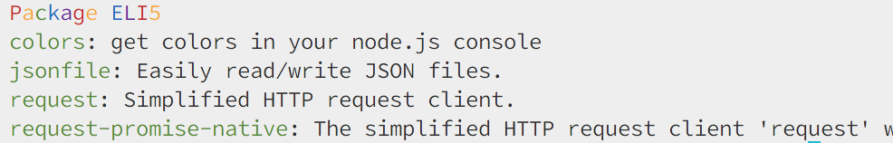

# Package ELI5



Ever get overwhelmed looking at your `package.json` file? Want to know what those trendily named packages are actually for?

## Usage

```bash
yarn package-eli5 [path to package.json]
```

Optionally include the path to a package json file. This can be either the path to the `package.json` file or the path to the folder containing the `package.json` file.

If this parameter is not included, then it is assumed there is a `package.json` file in the current directory.